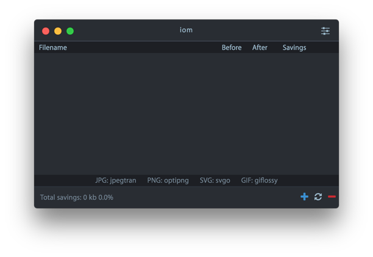
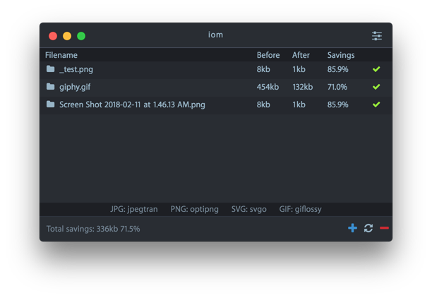
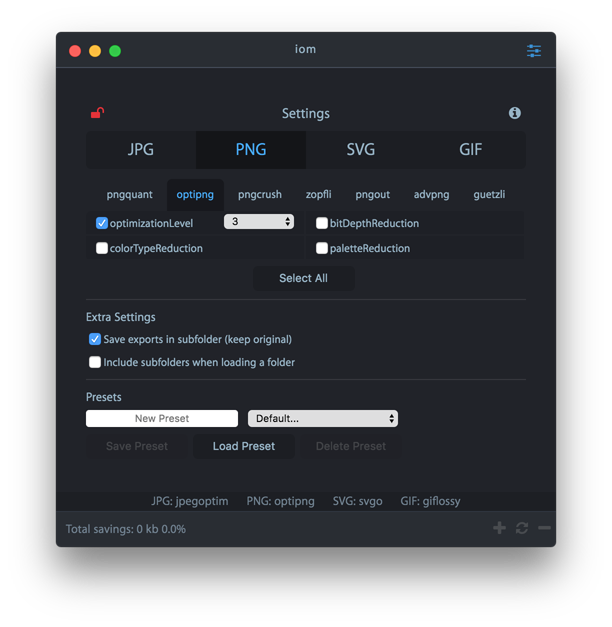

[](https://github.com/JavierAroche/iom)

## Description
Image optimization manager to minify images using [imagemin](https://github.com/imagemin/imagemin).

## Latest Release
* [iom - MacOS](https://github.com/JavierAroche/iom/releases/download/v0.1.0/iom_macos_v0.1.0.zip)
* [iom - Windows](https://github.com/JavierAroche/iom/releases/download/v0.1.0/iom_windows_v0.1.0.zip)
* [iom - Linux](https://github.com/JavierAroche/iom/releases/download/v0.1.0/iom_linux_v0.1.0.zip)

## Usage
Drag and drop images to the iom app. Click on the settings icon to change imagemin's plugin settings.

NOTE: Images will not be overwritten by default. Change this behavior in the settings.

## Protocol
```
iom:///file
```

## Screenshots






## License
MIT © Javier Aroche
